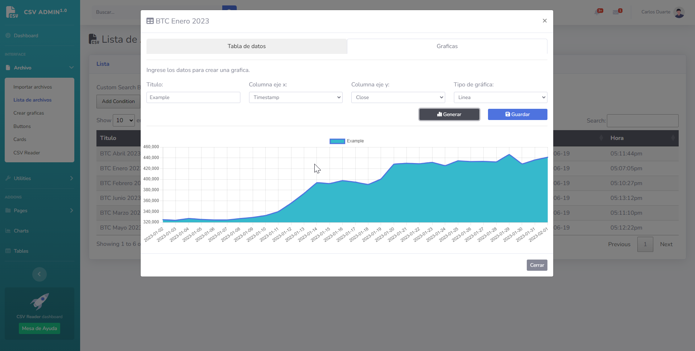

# csv-dashboard
A little csv dashboard admin
# Carlos Duarte

## Table of contents

- [Overview](#overview)
  - [Screenshot](#screenshot)
  - [Links](#links)
- [My process](#my-process)
  - [Built with](#built-with)
  - [What I learned](#what-i-learned)
- [Author](#author)

## Overview
This is a little csv dashboard admin, you can ubmit csv files and admin the data like tables and charts.

### Screenshot

### Links

- Repositorie URL: ([github.com/RamRider89/csv-dashboard/](https://github.com/RamRider89/csv-dashboard))
- Live Site URL: ([ramrider89.github.io/csv-dashboard/](https://ramrider89.github.io/csv-dashboard/))

## My process

### Built with

- Semantic HTML5 markup
- PHP + Javascript
- Bootstrap
- [Jquery](https://www.jquery.com/)
- [Momentjs](https://www.momentjs.com/) - JS Library for dates
- [DataTables](https://datatables.net/) - JS Library for tables
- [Chart.js](https://www.chartjs.org/) - JS Library for charts
- [PapaParse](https://www.papaparse.com/) - JS Library to import CSV files
- [Bootstrap](https://www.getbootstrap.com/)
- [FontAwesome](https://fontawesome.com/search?m=free&o=r)

## Author

- Website - [Carlos David Duarte](https://www.davdav.tech)
- Mail - [hola@davdav.tech](mailto:hola@davdav.tech)
- Twitter - [@davidgillnn](https://www.twitter.com/davidgillnn)
- GitHub - [@RamRider89](https://github.com/RamRider89/)